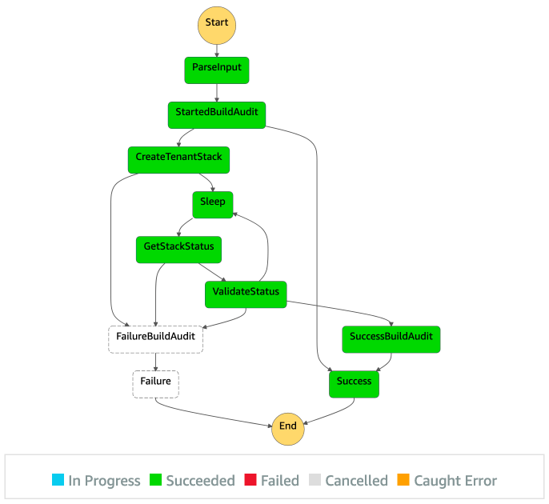

## Resource Lifecycle


### Overview

Tenant resources including queues, event source mappings, and alarms have 3 lifecycle events:

- Create: the tenant stack is created with the deployments current CDK program version and DynamoDB metadata item is inserted
- Update: the tenant stack is updated to the current CDK program version and DynamoDB metadata item is updated
- Delete: the tenant stack is destroyed and DynamoDB metadata item is deleted


### Provisioning of Tenant Assets

The [DeployTenantStack](../functions/tenant_resources/deploy_stack) Lambda from the core stack is responsible for creating and updating the individual tenant CloudFormation stacks. The [DestroyTenantStack](../functions/tenant_resources/destroy_stack) Lambda handles tenant deletion.

The CloudFormation template is versioned via the [version.txt](../functions/tenant_resources/deploy_stack/version.txt) file. Any changes to the template will only take effect if this version number is changed.

The stack contains a custom resource that represents the DynamoDB metadata item. CloudFormation will, create, update, and delete that database item along with the other stack resources.


### Step Functions

There is a Step Function for each of these lifecycle events:



Step Function writes an audit entry, triggers the Lambda that creates the CloudFormation stack, polls the stack to see when creation finishes, then updates the audit entry based on the outcome.

The create Step Function takes an input that looks like:
```
{
  "tenantId": "00000000-0000-0000-000000000000",
  "currentCount": "0",
  "retryCount": "1",
  "clientId": "0000000"
}
```

The update and delete Step Functions take inputs that look like:
```
{
  "tenantId": "00000000-0000-0000-000000000000"
}
```


### Dev Resource Cleanup

Deleting the fnds-connector stack will not delete the tenant stacks.  You must delete the tenant stacks before the fnds-connector stack either by api or through the CloudFormation console.
